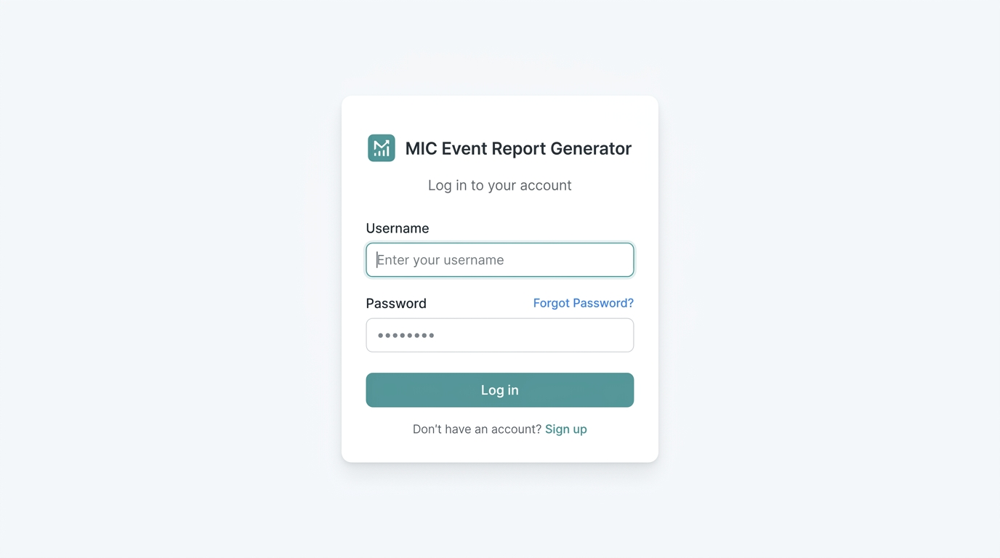

# MIC Event Report Generator

Automate the creation, management, and administration of event reports for the Microsoft Innovations Club (MIC) at VIT Chennai. This application replaces manual report formatting by generating documents that match the official VIT event report template.



## Key Features

- **Conversational Wizard**: Tally-style form interface that collects event details step-by-step to avoid form fatigue.
- **CSV Attendance Mapping**: Upload participant CSV files. Column headers are automatically detected, types (Student, Faculty, External) are identified, and participant counts are calculated instantly.
- **LLM Outcomes Refinement**: Refine pasted report drafts using the Groq LLaMA model to improve clarity and grammar while keeping original facts.
- **Rich Document Exports**:
  - **Standard DOCX**: Generates a text-filled document based on the official Word template.
  - **Rich Word DOC**: Generates a rich text document with brochure flyer, event execution photos, and electronic faculty signatures embedded as base64 images.
- **Admin Controls**: Manage faculty coordinators, signatures, configuration defaults (venues, event types), and review uploaded reports.
- **Aesthetic Theme**: Monochromatic visual layout using light mode only, soft off-white background, and configurable accent colors.

## Setup Instructions

### Prerequisites
- Node.js (v18 or higher)
- npm

### Installation
1. Clone the repository:
   ```bash
   git clone https://github.com/ramnnn2006/reporter.git
   cd reporter
   ```

2. Install dependencies:
   ```bash
   npm install
   ```

3. Run local dev server:
   ```bash
   npm run dev
   ```

4. Build production bundle:
   ```bash
   npm run build
   ```

## Tech Stack
- Vite 5 (Bundler)
- React (Frontend Library)
- Vanilla CSS (Styling)
- Docxtemplater & PizZip (DOCX Template Engine)
- PapaParse (CSV Parser)
- Lucide React (Icons)
